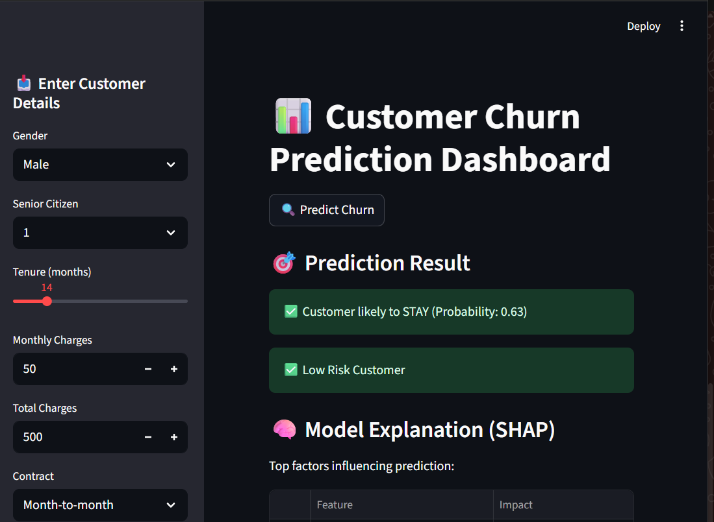
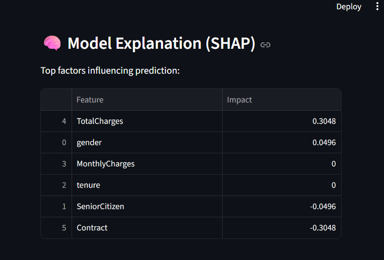
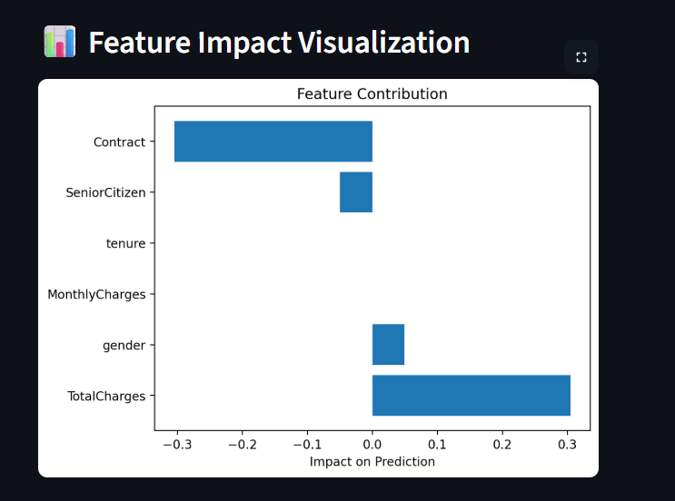
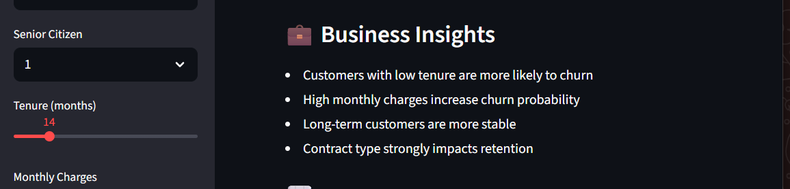
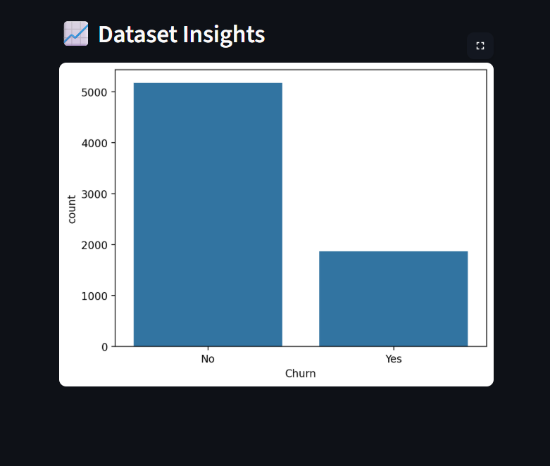

# 📊 Customer Churn Prediction Dashboard


## 🚀 Overview

This project predicts whether a customer is likely to churn using Machine Learning and provides an **interactive Streamlit dashboard** for real-time predictions, explainability, and business insights.

---

## 🎯 Objective

* Identify customers at high risk of churn
* Enable targeted retention strategies
* Provide explainable predictions using SHAP
* Help businesses reduce revenue loss

---

## 🛠️ Tech Stack

* **Programming:** Python
* **Libraries:** Pandas, NumPy, Scikit-learn, XGBoost
* **Visualization:** Matplotlib, Seaborn
* **Dashboard:** Streamlit
* **Explainability:** SHAP

---

## 📂 Dataset

* Telco Customer Churn Dataset (Kaggle)

---

## ⚙️ Features

### 🔹 1. Churn Prediction

* Predicts whether a customer will churn or stay
* Displays probability score
---

### 🔹 2. Risk Classification

* 🔥 High Risk
* ⚠️ Medium Risk
* ✅ Low Risk
---

### 🔹 3. Feature Importance

* Shows which features influence churn the most
---

### 🔹 4. Explainable AI (SHAP)

* Displays feature impact on prediction
* Helps understand *why* a customer may churn
---

### 🔹 5. Business Insights Dashboard

* Key patterns derived from data
---

## 📊 Model Performance

* Accuracy: ~75–80%
* ROC-AUC Score: ~0.75
* Model Used: XGBoost Classifier

---

## ▶️ How to Run

### 1️⃣ Clone Repository

```bash
git clone https://github.com/your-username/customer-churn-prediction-ml-dashboard.git
cd customer-churn-prediction-ml-dashboard
```

### 2️⃣ Install Dependencies

```bash
pip install -r requirements.txt
```

### 3️⃣ Train Model

```bash
python main.py
```

### 4️⃣ Run Streamlit App

```bash
streamlit run streamlit_app.py
```

---

## 📁 Project Structure

```
Customer-Churn-Prediction/
│
├── data/
│   └── churn.csv
│
├── models/
│   ├── churn_model.pkl
│   └── scaler.pkl
│
├── outputs/
│   ├── feature_importance.png
│   └── roc_curve.png
│
├── images/
│   ├── dashboard_overview.png
│   ├── prediction_result.png
│   ├── shap_output.png
│   └── feature_importance.png
│
├── streamlit_app.py
├── main.py
├── requirements.txt
└── README.md
```

---

## 💡 Business Insights

* Customers with **low tenure** are more likely to churn
* **High monthly charges** increase churn probability
* Long-term customers are more stable
* Contract type strongly impacts retention

---
## 📊 customer_churn_dashboard


## 🧠 model_explanation


## 🎯 feature_impact_visualization


## 📈 Feature Importance
.png)

## 🧠 business_insights


## 🧠 dataset_insights


## 🔮 Future Improvements

* Deploy on Streamlit Cloud / AWS
* Add real-time API using FastAPI
* Improve UI/UX design
* Add customer segmentation (clustering)
* Add PDF report generation

---

## 👨‍💻 Author

SHWETA SINGH

---

## ⭐ If you like this project

Give it a ⭐ on GitHub
